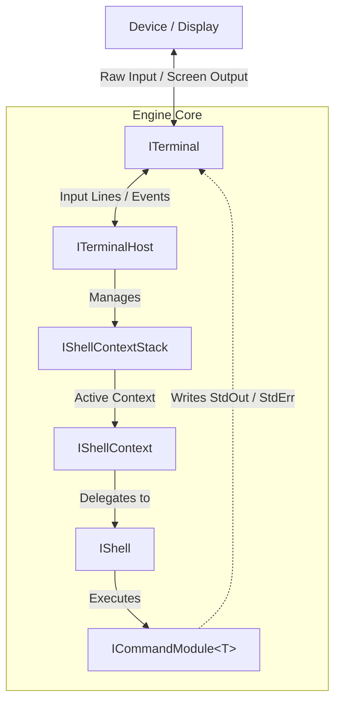

# Custom Engine Implementation Guide

This guide details how to implement custom versions of the core `DingOS` interfaces defined in `Runtime/Core/`.

Whether you are building a custom UI backend (e.g., Unity UI Toolkit, ImGui, WebSocket bridge), writing a custom execution engine, or managing custom state scopes, this reference outlines the contract rules and behavioral expectations for each component.

---

## Architecture Overview

`DingOS` uses a decoupled pipe-and-filter architecture:

<details>
<summary>Click to view ASCII Diagram</summary>

```text
[ Device / Display ]
        ^
        | (Raw Keys / Screen Output)
        v
  +-----------+
  | ITerminal | <===================================+
  +-----+-----+                                     |
        |                                           |
        | (Input Lines / Events)                    |
        v                                           |
 +--------------+   Manages   +--------------------+|
 | ITerminalHost| ----------> | IShellContextStack ||
 +--------------+             +---------+----------+|
                                        |           |
                                        v (Active)  |
                              +--------------------+|
                              |   IShellContext    ||
                              +---------+----------+|
                                        |           |
                                        v           |
                              +--------------------+|
                              |       IShell       ||
                              +---------+----------+|
                                        |           |
                                        v (Executes)|
                              +--------------------+|
                              | ICommandModule<T>  ||
                              +---------+----------+|
                                        |           |
                                        +-----------+
                                    (StdOut / StdErr)
```

</details>



---

## Implementing `ITerminal`

`ITerminal` defines low-level string I/O and screen clearing mechanics. Implement this interface to pipe output into UI text elements, network sockets, or custom logs.

### Interface Contract

```csharp
namespace TrickleCharge.DingOS.Core
{
    public interface ITerminal
    {
        void Write(string text);
        void WriteLine(string text);
        void WriteError(string text);
        void WriteErrorLine(string text);
        string ReadLine();
        void Clear();
    }
}
```

### Key Implementation Guidelines

- **Stream Separation:** Keep standard output (`Write`/`WriteLine`) distinct from error output (`WriteError`/`WriteErrorLine`). In custom UI components, error calls should apply visual cues (such as red text tags or routing to a separate error log).
- **Push vs. Pull Model for `ReadLine()`:**
  - **Pull Model (CLI/Console):** `ReadLine()` should block execution until a full line of text is submitted.
  - **Push Model (Unity/UI/Web):** In non-blocking event-driven environments, `ReadLine()` is not invoked by `ExecuteAsync`. You can safely throw `NotSupportedException` or return `string.Empty`.
- **Viewport Reset (`Clear()`):** Must reset or flush the target UI text buffer immediately.

### Custom Terminal Example (Unity / GUI Buffer)

```csharp
using System;
using System.Text;
using TrickleCharge.DingOS.Core;

public class UIBufferTerminal : ITerminal
{
    private readonly StringBuilder _displayBuffer = new();

    public string Text => _displayBuffer.ToString();
    public event Action? BufferUpdated;

    public void Write(string text)
    {
        _displayBuffer.Append(text);
        BufferUpdated?.Invoke();
    }

    public void WriteLine(string text)
    {
        _displayBuffer.AppendLine(text);
        BufferUpdated?.Invoke();
    }

    public void WriteError(string text)
    {
        _displayBuffer.Append($"<color=red>{text}</color>");
        BufferUpdated?.Invoke();
    }

    public void WriteErrorLine(string text)
    {
        _displayBuffer.AppendLine($"<color=red>{text}</color>");
        BufferUpdated?.Invoke();
    }

    public string ReadLine() => throw new NotSupportedException("Push-based terminals do not support blocking ReadLine calls.");

    public void Clear()
    {
        _displayBuffer.Clear();
        BufferUpdated?.Invoke();
    }
}
```

---

## Implementing `IShell`

`IShell` is responsible for receiving raw command strings, parsing arguments, invoking execution logic, 
and emitting control signals.

> **Note:** `DingOS` includes `CommandShell` out of the box (built on `System.CommandLine`). 
> You only need to implement `IShell` if you are replacing `CommandShell` with an alternative 
> command execution engine or scripting language (e.g., Lua).

### Interface Contract

```csharp
namespace TrickleCharge.DingOS.Core
{
    public interface IShell
    {
        event Action? ClearRequested;
        event Action? QuitRequested;

        Task<ShellResult> ExecuteAsync(
            string commandLine,
            TextWriter? outputWriter = null,
            TextWriter? errorWriter = null,
            CancellationToken cancellationToken = default);
    }
}
```

### Key Implementation Guidelines

- **Output Scope Routing:** Send standard output to `outputWriter` and errors to `errorWriter`.
- **Engine Control Signals:** Raise `ClearRequested` when execution requires a terminal clear, and `QuitRequested` 
when execution requires exiting or popping the context stack.
- **Return Conventions:** Always return a valid `ShellResult`. Empty or whitespace input should return `ShellResult.Empty`.

---

## Implementing `IShellContext`

`IShellContext` represents an active modal execution scope on the context stack. It couples a named environment prompt to an underlying `IShell` execution engine.

### Interface Contract

```csharp
namespace TrickleCharge.DingOS.Core
{
    public interface IShellContext
    {
        string Name { get; }
        string Prompt { get; }
        IShell Shell { get; }

        event Action? ClearRequested;
        event Action? QuitRequested;

        Task<ShellResult> ProcessInputAsync(
            string input,
            TextWriter? outputWriter = null,
            TextWriter? errorWriter = null,
            CancellationToken cancellationToken = default);

        void Activate(ITerminal terminal);
        void Deactivate(ITerminal terminal);
    }
}
```

### Key Implementation Guidelines

- **Event Forwarding:** A context must subscribe to its inner `Shell.ClearRequested` and `Shell.QuitRequested` events and re-emit them so the parent stack context manager can handle them.
- **Lifecycle Hooks:** `Activate()` and `Deactivate()` are invoked by the `IShellContextStack` implementation when pushing or popping contexts. Use them to print banners, bind UI events, or initialize sub-shell state.
- **Resource Cleanup:** If your context or shell registers event handlers or holds unmanaged resources, implement `IDisposable`.

---

## Implementing `IShellContextStack`

`IShellContextStack` manages the lifetime and navigation hierarchy of `IShellContext` instances (e.g., entering sub-shells, SSH sessions, or modal prompts).

### Interface Contract

```csharp
namespace TrickleCharge.DingOS.Core
{
    public interface IShellContextStack
    {
        IShellContext? CurrentContext { get; }
        string ActivePrompt { get; }
        void PushContext(IShellContext context);
        void PopContext();
    }
}
```

### Key Implementation Guidelines

1. **Stack Transitions:**
   - When `PushContext` is called:
     1. Unbind events from the previous `CurrentContext`.
     2. Call `Deactivate(_terminal)` on the previous context.
     3. Push the new context onto the stack.
     4. Bind clear/quit events on the new context.
     5. Call `Activate(_terminal)` on the new context.
2. **Auto-Popping on Quit:** Hook into `QuitRequested` on the top context. When fired, automatically invoke `PopContext()`.
3. **Resource Disposal on Pop:** When popping a context from the stack, check if poppedContext is IDisposable disposable 
and invoke Dispose() prior to activating the underlying context.
4. **Screen Clearing on Clear:** Hook into `ClearRequested` on the top context. When fired, trigger `ITerminal.Clear()`.
5. **Fallback Prompts:** Ensure `ActivePrompt` falls back to a clean default (e.g., `"> "`) if the stack is completely empty.

---

## Implementing `ITerminalHost`

`ITerminalHost` bridges `ITerminal` and `IShellContextStack` together. It acts as the primary API endpoint for both CLI pull loops and event-driven push architectures.

### Interface Contract

```csharp
namespace TrickleCharge.DingOS.Core
{
    public interface ITerminalHost
    {
        IShellContextStack ContextStack { get; }

        Task RunConsoleLoopAsync(CancellationToken cancellationToken = default);
        Task<ShellResult> ExecuteAsync(string input, CancellationToken cancellationToken = default);
    }
}
```

### Execution Flow Rules for `ExecuteAsync`

When implementing `ExecuteAsync(string input, CancellationToken cancellationToken)`:

1. **Empty Stack Guard:** Check if `ContextStack.CurrentContext` is `null`. If so, immediately return `ShellResult.Empty`.
2. **Stream Bridging:** Wrap `ITerminal` standard output and error delegates in `TextWriter` instances 
(e.g., `TerminalTextWriter`) so terminal writes flow cleanly into `ProcessInputAsync(...)`.
3. **Delegate Processing:** Forward the input line to `ContextStack.CurrentContext.ProcessInputAsync(...)`.

---

## Writing Custom Command Modules (`ICommandModule<T>`)

Command modules define grouped commands. Modules implement `ICommandModule<TCommand>`, where `TCommand` corresponds to 
your shell's command definition type (e.g., `System.CommandLine.Command`).

### Interface Contract

```csharp
namespace TrickleCharge.DingOS.Core
{
    public interface ICommandModule<out TCommand>
    {
        IEnumerable<TCommand> GetCommands(IShellEnvironment environment);
    }
}
```

### `IShellEnvironment` Rules

Commands must **never** write directly to standard `Console.Out` or `Console.Error`. Instead, use the `IShellEnvironment` instance passed to `GetCommands()`:

- **Output:** Route standard messages through `environment.Out`.
- **Errors:** Route errors through `environment.Error`.
- **State Operations:** Invoke `environment.RequestClear()` or `environment.RequestQuit()` to request terminal resets or exit shell contexts.

### Module Implementation Example

```csharp
using System.Collections.Generic;
using System.CommandLine;
using TrickleCharge.DingOS.Core;

public class DiagnosticsModule : ICommandModule<Command>
{
    public IEnumerable<Command> GetCommands(IShellEnvironment environment)
    {
        yield return SysInfo(environment);
    }

    public static Command SysInfo(IShellEnvironment environment)
    {
        Command sysInfoCmd = new("sysinfo", "Displays system information.");
        sysInfoCmd.Aliases.Add("ver");
        sysInfoCmd.SetAction(_ => environment.Out.WriteLine(SystemInfo.VersionString));
        return sysInfoCmd;
    }
}
```

`GetCommands()` returns an `IEnumerable` of the given command type.

This means a module can return multiple commands by yielding each in sequence.

```csharp
public class CoreShellModule : ICommandModule<Command>
{
    // ...
    
    public IEnumerable<Command> GetCommands(IShellEnvironment environment)
    {
        yield return Exit(environment);
        yield return Clear(environment);
        yield return Help(environment, _shell);
    }
    
    // ...
}
```

> See: `TrickleCharge.DingOS.Modules.CoreShellModule`