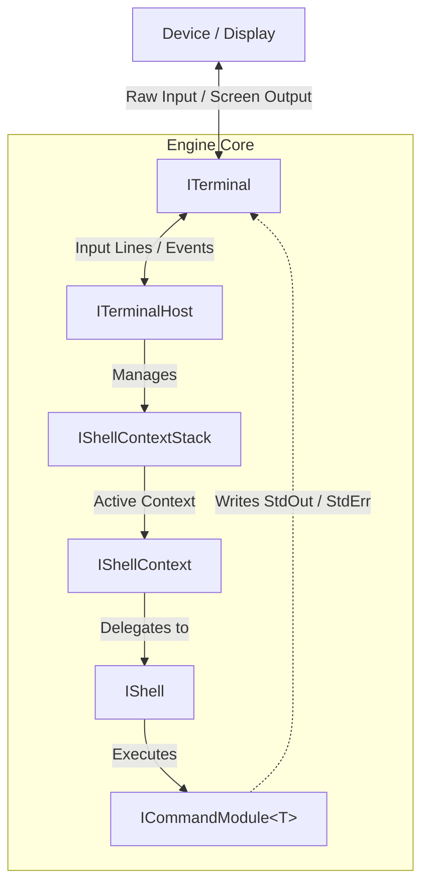

# DingOS

[📖 Documentation](https://docs.tricklecharge.dev/dingos/Documentation~/)

**DingOS** is a decoupled terminal architecture and context stack manager for .NET and Unity applications. 
It separates user input/output interfaces from command parsing and execution logic, 
allowing you to host interactive shell environments in standalone CLI applications, 
Unity UI frameworks (UI Toolkit, TextMeshPro, Canvas UGUI), or remote debugging consoles.

Out of the box, DingOS includes a flexible command execution engine powered by `System.CommandLine`.

---

## Key Features

* **Decoupled Architecture:** Completely separates terminal display logic from command execution, enabling integration 
across console apps, custom UI buffers, or network sockets.
* **Dual Execution Models:**
    * **Pull Model:** Blocking execution loop for continuous CLI terminal applications.
    * **Push Model:** Event-driven execution endpoint (`ExecuteAsync`) designed for frame-based or event-driven 
environments like Unity or Web frontends.
* **Modal Context Stack:** Push and pop execution contexts dynamically (`IShellContextStack`) to handle nested 
sub-shells, sub-modes, SSH-like remote sessions, or custom prompt states.
* **Modular Command Registration:** Define cleanly separated command suites via `ICommandModule<T>` 
built on `System.CommandLine`.
* **Zero Engine Dependencies:** Core runtime is target-built for `.NETStandard 2.1` with zero direct 
dependencies on `UnityEngine` assemblies.

---

## Core Architecture

DingOS divides terminal processing into four primary roles:

| Component                | Responsibility                                                                                       |
|:-------------------------|:-----------------------------------------------------------------------------------------------------|
| **`ITerminal`**          | Handles low-level I/O streams (Console output, Unity UI text elements, network sockets).             |
| **`IShell`**             | Parses raw command strings, routes arguments, and invokes underlying command logic.                  |
| **`IShellContextStack`** | Manages modal session states, prompt transitions, and sub-shell hierarchies (`ShellContextManager`). |
| **`ITerminalHost`**      | Bridges the terminal display layer and active context stack together into a cohesive execution loop. |

Architecture Diagram

---

## Quickstart

See [DingOS Documentation](Documentation~/index.md) for a quickstart guide.

---

## Built-in Modules

DingOS ships with built-in interactive modules registered automatically via `.WithInteractiveDefaults()`:

* **`CoreShellModule`:**
    * `help [topic]` – Interactive command and subcommand help.
    * `clear` / `clr` – Clears terminal buffer.
    * `exit` / `quit` – Pops current shell context or quits loop.
* **`DiagnosticsModule`:**
    * `sysinfo` / `ver` – Prints application name and version details.
    * `uptime [-f format]` – Prints system runtime duration.
* **`UtilityModule`:**
    * `echo [text]` – Echoes text back to output.

---

## Advanced Documentation

For deeper customization, architectural diagrams, and contract rules on implementing custom backends (e.g., custom `ITerminal` buffers, network streaming, or context stacks), see:

* [Custom Engine Implementation Guide](Documentation~/custom-implementations.md)

---

## License

This project is licensed under the MIT License. See [LICENSE.md](LICENSE.md) for details.